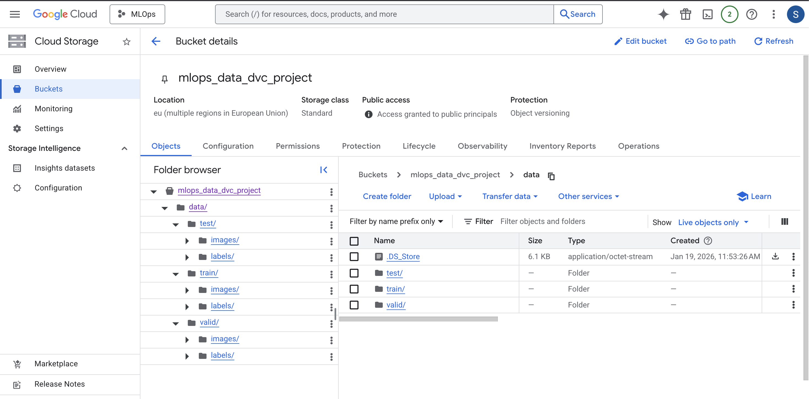

# Exam template for 02476 Machine Learning Operations

This is the report template for the exam. Please only remove the text formatted as with three dashes in front and behind
like:

```--- question 1 fill here ---```

Where you instead should add your answers. Any other changes may have unwanted consequences when your report is
auto-generated at the end of the course. For questions where you are asked to include images, start by adding the image
to the `figures` subfolder (please only use `.png`, `.jpg` or `.jpeg`) and then add the following code in your answer:

``

In addition to this markdown file, we also provide the `report.py` script that provides two utility functions:

Running:

```bash
python report.py html
```

Will generate a `.html` page of your report. After the deadline for answering this template, we will auto-scrape
everything in this `reports` folder and then use this utility to generate a `.html` page that will be your serve
as your final hand-in.

Running

```bash
python report.py check
```

Will check your answers in this template against the constraints listed for each question e.g. is your answer too
short, too long, or have you included an image when asked. For both functions to work you mustn't rename anything.
The script has two dependencies that can be installed with

```bash
pip install typer markdown
```

or

```bash
uv add typer markdown
```

## Overall project checklist

The checklist is *exhaustive* which means that it includes everything that you could do on the project included in the
curriculum in this course. Therefore, we do not expect at all that you have checked all boxes at the end of the project.
The parenthesis at the end indicates what module the bullet point is related to. Please be honest in your answers, we
will check the repositories and the code to verify your answers.

### Week 1

* [X] Create a git repository (M5)
* [X] Make sure that all team members have write access to the GitHub repository (M5)
* [X] Create a dedicated environment for you project to keep track of your packages (M2)
* [X] Create the initial file structure using cookiecutter with an appropriate template (M6)
* [X] Fill out the `data.py` file such that it downloads whatever data you need and preprocesses it (if necessary) (M6)
* [X] Add a model to `model.py` and a training procedure to `train.py` and get that running (M6)
* [X] Remember to either fill out the `requirements.txt`/`requirements_dev.txt` files or keeping your
    `pyproject.toml`/`uv.lock` up-to-date with whatever dependencies that you are using (M2+M6)
* [X] Remember to comply with good coding practices (`pep8`) while doing the project (M7)
* [X] Do a bit of code typing and remember to document essential parts of your code (M7)
* [X] Setup version control for your data or part of your data (M8)
* [ ] Add command line interfaces and project commands to your code where it makes sense (M9)
* [X] Construct one or multiple docker files for your code (M10)
* [X] Build the docker files locally and make sure they work as intended (M10)
* [ ] Write one or multiple configurations files for your experiments (M11)
* [ ] Used Hydra to load the configurations and manage your hyperparameters (M11)
* [X] Use profiling to optimize your code (M12)
* [X] Use logging to log important events in your code (M14)
* [X] Use Weights & Biases to log training progress and other important metrics/artifacts in your code (M14)
* [X] Consider running a hyperparameter optimization sweep (M14)
* [ ] Use PyTorch-lightning (if applicable) to reduce the amount of boilerplate in your code (M15)

### Week 2

* [X] Write unit tests related to the data part of your code (M16)
* [X] Write unit tests related to model construction and or model training (M16)
* [X] Calculate the code coverage (M16)
* [X] Get some continuous integration running on the GitHub repository (M17)
* [X] Add caching and multi-os/python/pytorch testing to your continuous integration (M17)
* [X] Add a linting step to your continuous integration (M17)
* [ ] Add pre-commit hooks to your version control setup (M18)
* [ ] Add a continues workflow that triggers when data changes (M19)
* [ ] Add a continues workflow that triggers when changes to the model registry is made (M19)
* [X] Create a data storage in GCP Bucket for your data and link this with your data version control setup (M21)
* [X] Create a trigger workflow for automatically building your docker images (M21)
* [X] Get your model training in GCP using either the Engine or Vertex AI (M21)
* [X] Create a FastAPI application that can do inference using your model (M22)
* [X] Deploy your model in GCP using either Functions or Run as the backend (M23)
* [X] Write API tests for your application and setup continues integration for these (M24)
* [X] Load test your application (M24)
* [ ] Create a more specialized ML-deployment API using either ONNX or BentoML, or both (M25)
* [ ] Create a frontend for your API (M26)

### Week 3

* [X] Check how robust your model is towards data drifting (M27)
* [ ] Setup collection of input-output data from your deployed application (M27)
* [ ] Deploy to the cloud a drift detection API (M27)
* [ ] Instrument your API with a couple of system metrics (M28)
* [ ] Setup cloud monitoring of your instrumented application (M28)
* [ ] Create one or more alert systems in GCP to alert you if your app is not behaving correctly (M28)
* [ ] If applicable, optimize the performance of your data loading using distributed data loading (M29)
* [ ] If applicable, optimize the performance of your training pipeline by using distributed training (M30)
* [ ] Play around with quantization, compilation and pruning for you trained models to increase inference speed (M31)

### Extra

* [ ] Write some documentation for your application (M32)
* [ ] Publish the documentation to GitHub Pages (M32)
* [X] Revisit your initial project description. Did the project turn out as you wanted?
* [X] Create an architectural diagram over your MLOps pipeline
* [X] Make sure all group members have an understanding about all parts of the project
* [X] Uploaded all your code to GitHub

## Group information

### Question 1
> **Enter the group number you signed up on <learn.inside.dtu.dk>**
>
> Answer:
> 
> Group 32

### Question 2
> **Enter the study number for each member in the group**
>
> Answer:
> 
> s250677, s252563, s254573, s250131, s250701 

### Question 3
> **Did you end up using any open-source frameworks/packages not covered in the course during your project? If so**
> **which did you use and how did they help you complete the project?**
>
> Recommended answer length: 0-200 words.
>
> Example:
> *We used the third-party framework ... in our project. We used functionality ... and functionality ... from the*
> *package to do ... and ... in our project*.
>
> Answer:

> In general we did not use any packages not covered in the course during the project work. We did however use ChatGPT for example with github, git issues and more.
> More specific case would be when one of the members accidentally forgot to pull before a push and then there was a discrepancy so the member could not push, so Chat helped with coming up with possible solutions and such.


## Coding environment

> In the following section we are interested in learning more about you local development environment. This includes
> how you managed dependencies, the structure of your code and how you managed code quality.

### Question 4

> **Explain how you managed dependencies in your project? Explain the process a new team member would have to go**
> **through to get an exact copy of your environment.**
>
> Answer:
> 
> We managed dependencies using Conda for the base environment > and pip for project/package dependencies. The repository contains an environment.yml that pins the Python version and creates a reproducible Conda environment, and a requirements.txt (plus requirements_dev.txt) that pins the Python packages needed to run the project (and extra developer tools such as formatting/testing). The project itself is installed as an editable package (pip install -e .) using the pyproject.toml, so imports work consistently and changes to src/mlops are picked up immediately.
> 
> To get an exact copy of the environment, a new team member would:
> 
> Create and activate the Conda environment:
> conda env create -f environment.yml
> conda activate mlopsenv
> 
> Install pinned dependencies and the project:
> pip install -r requirements.txt
> pip install -r requirements_dev.txt (optional, for development)
> pip install -e .
> 
> This reproduces the same package versions and project setup across machines.

### Question 5

> **We expect that you initialized your project using the cookiecutter template. Explain the overall structure of your**
> **code. What did you fill out? Did you deviate from the template in some way?**
>
> Answer:
> 
> We initialized the repository from the DTU MLOps cookiecutter template, which gave us a standard project layout with separation between code, configs, experiments, outputs, and tests. The core implementation lives in src/mlops/, where we keep the model definition (model.py), dataset handling and download logic (data.py), training (train.py). Configuration is stored in configs/, trained weights are stored in models/, and generated artifacts such as profiling outputs and reports are stored in reports/. We also keep notebooks/ for exploration and tests/ for unit tests.
> 
> We deviated slightly from the template by trimming (we did nor use the notebbok folder) or adding project-specific files for deployment (e.g., Dockerfile, cloudbuild.yaml) and monitoring/logging outputs (log/). Overall, we kept the cookiecutter structure but adapted it to our image-based emotion classification pipeline and Cloud Run deployment.

### Question 6

> **Did you implement any rules for code quality and format? What about typing and documentation? Additionally,**
> **explain with your own words why these concepts matters in larger projects.**
>
> Recommended answer length: 100-200 words.
>
> Example:
> *We used ... for linting and ... for formatting. We also used ... for typing and ... for documentation. These*
> *concepts are important in larger projects because ... . For example, typing ...*
>
> Answer:

>  We used the material from core module M17 for linting that builds open our unit testing. We tried to set it up rather late so we did not experience the big positive effect of linting and we struggled to get it to work properly. But linting would help improve coding in a way that it runs the units tests so it will flag any code that do not run smoothly, therefore catching errors early on.

> All members of the group followed consistent formatting conventions aligned with Pep-8 and used descriptive naming for variables, functions and classes throughout the project. We also agreed upon using the same environment setup and ensured consistent package management by frequently updating the requirements.txt file to prevent compatibility issues between files and help maintain a stable development environment.

> We place particular emphasis on documentation, adding docstrings to core functions such as data loading, model training and API endpoints to describe the purpose, input parameters and expected behaviour. In addition to docstrings, we added inline comments to better clarify implementation choices or logic. 
> Furthermore, we integrated Loguru in the core files of our project, ensuring that our code is logged consistently despite differences in coding styles.  

> Implementing agreed-upon coding practices ensured that each team member could write code that built seamlessly upon another member’s work, without encountering difficulties in understanding the underlying logic or dependency errors. 

## Version control

> In the following section we are interested in how version control was used in your project during development to
> corporate and increase the quality of your code.

### Question 7

> **How many tests did you implement and what are they testing in your code?**
>
> Recommended answer length: 50-100 words.
>
> Example:
> *In total we have implemented X tests. Primarily we are testing ... and ... as these the most critical parts of our*
> *application but also ... .*
>
> Answer:

> In total, we implemented 9 unit and integration tests across multiple files. 
> The tests in test_data.py verify correct data loading and preprocessing once the dataset is available locally.  test_model.py ensures the model produces outputs of the expected shape and supports a valid forward pass. test_training.py checks that a single training step executes correctly and that training and evaluation return valid loss and accuracy values. 
> Finally, test_api.py performs integration testing of the FastAPI application by validating the health endpoint and ensuring that image-based predictions return a valid emotion label and confidence score.


### Question 8

> **What is the total code coverage (in percentage) of your code? If your code had a code coverage of 100% (or close**
> **to), would you still trust it to be error free? Explain you reasoning.**
>
> Recommended answer length: 100-200 words.
>
> Example:
> *The total code coverage of code is X%, which includes all our source code. We are far from 100% coverage of our **
> *code and even if we were then...*
>
> Answer:

> The total code coverage of our project is approximately 79%, representing the proportion of source code statements executed by our unit tests. Coverage varies largely across files: data.py 45%, model.py 90%, app.py 90% and train.py 70%. Notably, some critical functionality remains untested; for example, the coverage of the data download logic in data.py is limited as it requires a personal Kaggle API key, which cannot be included in automated tests published on GitHub. 
> It is important to note that code coverage measures the number of code lines that are successfully executed and is not a measure of correctness; thus, full coverage does not guarantee an error-free system. 

### Question 9

> **Did you workflow include using branches and pull requests? If yes, explain how. If not, explain how branches and**
> **pull request can help improve version control.**
>
> Answer:
> 
> In our project we did not actively use branches and pull requests as part of our day-to-day workflow. We mainly worked directly on the main branch and coordinated work by dividing tasks across different files and components (e.g. one person working on the API, another on training or data handling). This worked reasonably well for our group size and project scope, but it was largely an implicit choice rather than a deliberate workflow decision.

> In our project we did not actively use branches and pull requests as part of our day-to-day workflow. We mainly worked directly on the main branch and coordinated work by dividing tasks across different files and components (e.g. one person working on the API, another on training or data handling). This worked reasonably well for our group size and project scope, but it was largely an implicit choice rather than a deliberate workflow decision.

### Question 10

> **Did you use DVC for managing data in your project? If yes, then how did it improve your project to have version**
> **control of your data. If no, explain a case where it would be beneficial to have version control of your data.**
>
> Recommended answer length: 100-200 words.
>
> Example:
> *We did make use of DVC in the following way: ... . In the end it helped us in ... for controlling ... part of our*
> *pipeline*
>
> Answer:

> Yes, we set up the system for DVC with the cloud bucket system from GCP. This created the files and folders .dvc, data.dvc and .dvcignore. Although in our dataloader we pull the data directly from the kaggle api, so we do not effectively use the dvc system. If for some reason kaggle api closes down or the data gets removed from kaggle, we can then change over to the dvc system, however it is not clear how to pull the data from the dvc system. 
> Controlling the versioning on the data can be a very important part of making a model and training said model. Different data can create a different model. It also makes the process more vulnerable when pulling data from another page because it will then depend on that page, therefore data version control can be very important. The dvc package works a lot like git keeping a lot of meta data about the data, so if one wants to add more data we can do that but we are still capable of using the original data as well to recreate the first model if wished.


### Question 11

> **Discuss you continuous integration setup. What kind of continuous integration are you running (unittesting,**
> **linting, etc.)? Do you test multiple operating systems, Python  version etc. Do you make use of caching? Feel free**
> **to insert a link to one of your GitHub actions workflow.**
>
> Recommended answer length: 200-300 words.
>
> Example:
> *We have organized our continuous integration into 3 separate files: one for doing ..., one for running ... testing*
> *and one for running ... . In particular for our ..., we used ... .An example of a triggered workflow can be seen*
> *here: <weblink>*
>
> Answer:

> Our continuous integration (CI) setup is implemented using GitHub Actions, focusing primarily on automated unit testing and dependency management. The workflow is triggered on every push and pull request to the main branch, ensuring that any code changes are immediately validated. The CI pipeline first sets up a Python environment using a specified version, installs dependencies from requirements.txt and requirements_dev.txt, and upgrades essential packaging tools such as pip, setuptools, and wheel. 
> Unit tests are executed with pytest, including coverage reporting via pytest-cov, allowing us to monitor which parts of the codebase are exercised. 
> Caching is leveraged for installed Python packages to reduce workflow runtime and improve efficiency while maintaining reproducibility. Our CI also supports multiple Python versions (currently 3.10, 3.12 and 3.13), with potential extension to multiple operating systems to ensure cross-platform reliability. Additionally, we have a separate .yaml file for linting, to test across Windows, Linux and macOS latest versions using Python 3.12, with caching implemented to speed up runs.
> An example of our triggered workflow can be seen here: GitHub Actions Workflow. Overall, this CI setup ensures that code quality, functionality, and dependency integrity are continuously validated, supporting reliable model development and deployment in an MLOps context.

## Running code and tracking experiments

> In the following section we are interested in learning more about the experimental setup for running your code and
> especially the reproducibility of your experiments.

### Question 12

> **How did you configure experiments? Did you make use of config files? Explain with coding examples of how you would**
> **run a experiment.**
>
> Answer:
> 
> We mainly configured experiments through simple command line arguments (e.g. selecting number of epochs), but we also used a YAML config for hyperparameter tuning with Weights & Biases sweeps. Our configs/sweep.yaml defines a random search over learning rate, batch size and optimizer, and optimizes validation accuracy.

### Question 13

> **Reproducibility of experiments are important. Related to the last question, how did you secure that no information**
> **is lost when running experiments and that your experiments are reproducible?**
>
> Recommended answer length: 100-200 words.
>
> Example:
> *We made use of config files. Whenever an experiment is run the following happens: ... . To reproduce an experiment*
> *one would have to do ...*
>
> Answer:
We ensured reproducibility of our experiments by combining strict version control, configuration management, and experiment tracking. All code was versioned using Git, ensuring that every experiment could be traced back to a specific commit. Dependencies were fully specified in requirements.txt and environment.yml, guaranteeing that the same software environment could be recreated across machines.

For experiment configuration, we used structured configuration files (via Hydra), which allowed us to define hyperparameters, data paths, and training settings in a declarative and repeatable way. Each experiment run stored its configuration alongside the results, ensuring that no parameter choices were lost.

Additionally, we used Docker to containerize the training environment, capturing system-level dependencies and eliminating environment-related inconsistencies. Experiment metrics, model checkpoints, and artifacts were logged using Weights & Biases, providing a complete history of each run. To reproduce an experiment, one only needs the corresponding Git commit, configuration file, and Docker image, ensuring full reproducibility without loss of information.


### Question 14

> **Upload 1 to 3 screenshots that show the experiments that you have done in W&B (or another experiment tracking**
> **service of your choice). This may include loss graphs, logged images, hyperparameter sweeps etc. You can take**
> **inspiration from [this figure](figures/wandb.png). Explain what metrics you are tracking and why they are**
> **important.**
>
> Recommended answer length: 200-300 words + 1 to 3 screenshots.
>
> Example:
> *As seen in the first image when have tracked ... and ... which both inform us about ... in our experiments.*
> *As seen in the second image we are also tracking ... and ...*
>
> Answer:

[Screenshot](/MLOps/reports/figures/Screenshot.png)
> As seen in the provided screenshot from our Weights & Biases dashboard, we are tracking six key metrics across our training runs. These metrics are vital for understanding the model's learning behavior:
* **val_loss and train_loss**: Here we track both to monitor convergence. The downward trend in both graphs indicates that the model is successfully learning to minimize the error in emotion classification. By comparing them, we can ensure the gap doesn't widen too much, which would signal overfitting.
* **val_acc and train_acc**: These track the percentage of correctly classified emotions. As seen in the graphs, our validation accuracy steadily improves alongside training accuracy, reaching approximately *27-30%* in the early steps.
* **test_acc**: We have logged a single point for test accuracy. This represents the final evaluation on a held-out dataset that the model never saw during training, providing an unbiased estimate of real-world performance.
* **epoch**: This helps us keep track of time and iterations, ensuring that the changes in loss and accuracy are mapped correctly to the number of passes through the AffectNet dataset.
> Tracking these specific metrics is important because emotion classification is a complex task with subtle differences between classes. These charts allow us to pinpoint exactly when the model stops improving and helps us decide when to stop training to save cloud compute costs.


### Question 15

> **Docker is an important tool for creating containerized applications. Explain how you used docker in your**
> **experiments/project? Include how you would run your docker images and include a link to one of your docker files.**
>
> Recommended answer length: 100-200 words.
>
> Example:
> *For our project we developed several images: one for training, inference and deployment. For example to run the*
> *training docker image: `docker run trainer:latest lr=1e-3 batch_size=64`. Link to docker file: <weblink>*
>
> Answer:

We used Docker in our project to make sure that our environment was the same every time we ran the application. This meant that whether we were working on our computers or using Google Cloud everything worked exactly the same way.We put our application in a container so that it had its version of Python, PyTorch and other libraries it needed. This kept these dependencies separate from the rest of the system, which made it easier to run tests and experiments.

Docker made it easier to run our experiments both on our local computers and, in Google Cloud Build without having to worry about problems caused by the environment. We used Docker to keep our Docker environment consistent which helped us to use Docker in a way.We created a single Docker image that installs all required dependencies from requirements.txt, copies the project source code, and runs a defined entry point for validating the dataset and executing a model forward pass. This image was used locally for testing and in the CI/CD pipeline to automatically build and push the image to Artifact Registry.https://github.com/lilizxx2k/MLOps-Emotion-Classification/blob/main/Dockerfile

### Question 16

> **When running into bugs while trying to run your experiments, how did you perform debugging? Additionally, did you**
> **try to profile your code or do you think it is already perfect?**
>
> Answer:
> 
> When running into bugs during experiments (such as training, evaluation, or API execution), we mainly relied on simple and practical debugging techniques. Most issues were identified by carefully reading Python error messages and stack traces, which often pointed directly to missing imports, incorrect paths, or shape mismatches in tensors. We also used print statements and logging (via loguru) to inspect intermediate values such as tensor shapes, model outputs, and loaded file paths during execution.
> 
> We also performed basic profiling of selected scripts using Python’s built-in cProfile module to get an overview of where execution time was spent. This showed that most of the runtime was dominated by PyTorch model loading and forward passes, which is expected. We did not aim to fully optimize performance.

## Working in the cloud

> In the following section we would like to know more about your experience when developing in the cloud.

### Question 17

> **List all the GCP services that you made use of in your project and shortly explain what each service does?**
>
> Recommended answer length: 50-200 words.
>
> Example:
> *We used the following two services: Engine and Bucket. Engine is used for... and Bucket is used for...*
>
> Answer:
We used a lot of Google Cloud Platform services in our project. These Google Cloud Platform services helped us with storing data and automating things. We also used Google Cloud Platform services to make our workflows work in containers. This made our project run smoothly with the help of Google Cloud Platform.We used Google Cloud Storage for our data because it can handle a lot of information. Google Cloud Storage was really good for storing files.

We also used it with Data Version Control so that our big data files were stored else but we could still keep track of the different versions of these files, in Git. This way Google Cloud Storage and Data Version Control worked together to help us manage our data.I used Google Cloud Build to automate making Docker images. This means that every time I made changes and pushed them to my GitHub repository the Docker images were made automatically. This is really helpful because it lets me do integration with Google Cloud Build and Docker images. I set up build triggers so that Google Cloud Build would make the Docker images, for me.
We used Google Artifact Registry to store and manage the Docker images that Cloud Build produced. This way we could keep the Docker images in one place, which made it easier to use them again and again. We were able to keep versions of the Docker images, which was really helpful. Google Artifact Registry was like a spot, in the cloud where we could store all of our Docker images.


### Question 18

> **The backbone of GCP is the Compute engine. Explained how you made use of this service and what type of VMs**
> **you used?**
>
> Recommended answer length: 100-200 words.
>
> Example:
> *We used the compute engine to run our ... . We used instances with the following hardware: ... and we started the*
> *using a custom container: ...*
>
> Answer:

Google Compute Engine is the underlying infrastructure for many managed services in Google Cloud Platform. In our project, we did not manually create or manage virtual machines ourselves. Instead, we made use of Compute Engine indirectly through managed GCP services, primarily Google Cloud Build.Google Compute Engine is the underlying infrastructure for many managed services in Google Cloud Platform. In our project, we did not manually create or manage virtual machines ourselves. Instead, we made use of Compute Engine indirectly through managed GCP services, primarily Google Cloud Build.When Cloud Build was triggered, Google automatically provisioned short-lived virtual machines based on Compute Engine to execute the steps defined in our cloudbuild.yaml. These virtual machines pulled the source code, built Docker images according to the Dockerfile, and pushed the images to Google Artifact Registry.

### Question 19

> **Insert 1-2 images of your GCP bucket, such that we can see what data you have stored in it.**
> **You can take inspiration from [this figure](figures/bucket.png).**
>
> Answer:





### Question 20

> **Upload 1-2 images of your GCP artifact registry, such that we can see the different docker images that you have**
> **stored. You can take inspiration from [this figure](figures/registry.png).**
>
> Answer:
We used Google Cloud Artifact Registry to store Docker images built as part of our CI/CD pipeline.
A Docker repository named `mlops-repo` was created in the `europe-west1` region.

The repository contains multiple Docker images, including `emotion-mlops` and `mlops_project`,
which were automatically built and pushed using Google Cloud Build. These images contain the
complete runtime environment, dependencies, and source code required to run the project.

The figures below show the Artifact Registry repository and the Docker images stored within it.


### Question 21

> **Upload 1-2 images of your GCP cloud build history, so we can see the history of the images that have been build in**
> **your project. You can take inspiration from [this figure](figures/build.png).**
>
> Answer:


### Question 22

> **Did you manage to train your model in the cloud using either the Engine or Vertex AI? If yes, explain how you did**
> **it. If not, describe why.**
>
> Recommended answer length: 100-200 words.
>
> Example:
> *We managed to train our model in the cloud using the Engine. We did this by ... . The reason we choose the Engine*
> *was because ...*
>
> Answer:

We did not train our model in the cloud using either AI Platform or Vertex AI, so our current setup relies on local development with a CPU-only environment. Training on Vertex AI would require configuring cloud storage for datasets, authentication via service accounts, and adapting our training scripts to run in a distributed or containerised environment. Due to time constraints, this was not feasible for the project. Furthermore, the relatively small size of our dataset and the limited complexity of our model made local training sufficient and still allowed for satisfactory results. 
We focused on implementing and testing the model locally, ensuring that unit tests, training routines, and evaluation functions work correctly with small batches of synthetic data. While cloud training was not executed, the project is structured in a way that could easily be adapted to Vertex AI in the future by containerising the training code, uploading datasets to Google Cloud Storage, and using Vertex AI jobs to leverage GPU acceleration for larger-scale experiments.


## Deployment

### Question 23

> **Did you manage to write an API for your model? If yes, explain how you did it and if you did anything special. If**
> **not, explain how you would do it.**
>
> Recommended answer length: 100-200 words.
>
> Example:
> *We did manage to write an API for our model. We used FastAPI to do this. We did this by ... . We also added ...*
> *to the API to make it more ...*
>
> Answer:

We successfully developed a REST API for our model using FastAPI. The core of the API is a `/predict` endpoint that accepts an image (or a path to one) and returns the classified emotion. 
One special feature we implemented was the use of FastAPI lifespan events to load the heavy PyTorch model into memory only once during the application startup. This prevents the overhead of reloading the model for every individual request, significantly reducing latency. Additionally, we included a **health check** endpoint (`/health`) that returns the status of the service and the model version, which is essential for cloud monitoring and load balancing.


### Question 24

> **Did you manage to deploy your API, either in locally or cloud? If not, describe why. If yes, describe how and**
> **preferably how you invoke your deployed service?**
>
> Recommended answer length: 100-200 words.
>
> Example:
> *For deployment we wrapped our model into application using ... . We first tried locally serving the model, which*
> *worked. Afterwards we deployed it in the cloud, using ... . To invoke the service an user would call*
> *`curl -X POST -F "file=@file.json"<weburl>`*
>
> Answer:

For deployment, we containerized our FastAPI application using Docker. We first verified the deployment locally by running the container and testing the endpoints using the built-in `/docs` Swagger UI. 
Afterward, we deployed the service to the cloud using Google Cloud. We used Cloud Build to automate the build-and-deploy pipeline, pushing our images to the Artifact Registry before deploying them to Cloud Run. To invoke the service, a user can send a POST request using `curl`, for example:

`curl -X POST "https://<your-cloud-run-url>/predict" -F "file=@emotion_sample.jpg"`

This setup ensures that our model is highly available and only consumes cloud resources when actually processing requests.


### Question 25

> **Did you perform any unit testing and load testing of your API? If yes, explain how you did it and what results for**
> **the load testing did you get. If not, explain how you would do it.**
>
> Recommended answer length: 100-200 words.
>
> Example:
> *For unit testing we used ... and for load testing we used ... . The results of the load testing showed that ...*
> *before the service crashed.*
>
> Answer:

Yes, we performed both unit testing and load testing to ensure the reliability of our system. 
For unit testing, we used pytest to validate individual components of our pipeline. Our test suite includes `test_data.py` for data integrity, `test_model.py`and `test_training.py` for architecture verification, and `test_api.py` for endpoint functionality. These tests allow us to catch regressions early in the development cycle, as evidenced by our integration of pytest into our terminal workflow.
For load testing, we utilized Locust to simulate concurrent traffic to our API. As seen in our recorded charts, we maintained a steady load of 10 concurrent users over a sustained period. The results showed a stable performance with *Total Requests per Second (RPS)* averaging around *4 requests*, and a *50th percentile response time* consistently under *200ms*. Even at the *95th percentile*, response times remained stable near *250ms*, with zero recorded failures. This demonstrates that our current deployment on GCP can reliably handle light-to-moderate concurrent traffic without degradation in service quality. The load testing results can be found in the *reports* folder on our repository. 


### Question 26

> **Did you manage to implement monitoring of your deployed model? If yes, explain how it works. If not, explain how**
> **monitoring would help the longevity of your application.**
>
> Recommended answer length: 100-200 words.
>
> Example:
> *We did not manage to implement monitoring. We would like to have monitoring implemented such that over time we could*
> *measure ... and ... that would inform us about this ... behaviour of our application.*
>
> Answer:

We did not implement monitoring of a deployed model in this project. The main focus of the project was on containerization, reproducibility, and automated building of Docker images rather than deployment and production monitoring.

If monitoring were implemented, it would significantly improve the longevity and reliability of the application. Monitoring would allow tracking of model performance over time and help detect issues such as data drift, where incoming data differs from the training data distribution, and performance degradation, where model predictions become less accurate. Additionally, system-level monitoring of metrics such as latency, memory usage, and error rates would help ensure stable operation of the application.

By combining monitoring with logging and alerting, potential problems could be identified early, enabling timely retraining or redeployment of the model and reducing the risk of incorrect predictions affecting users.

## Overall discussion of project

> In the following section we would like you to think about the general structure of your project.

### Question 27

> **How many credits did you end up using during the project and what service was most expensive? In general what do**
> **you think about working in the cloud?**
>
> Recommended answer length: 100-200 words.
>
> Example:
> *Group member 1 used ..., Group member 2 used ..., in total ... credits was spend during development. The service*
> *costing the most was ... due to ... . Working in the cloud was ...*
>
> Answer:

Group member 1 used $1.55 for data version control for the service cloud storage. Group member 2 used 0.11dkk for the service cloud run when deploying the API. In total $1.57 or 9.66dkk was spent during development. The service costing the most was cloud storage due to a high volume of data being stored. Working in the cloud was new to us and quite challenging at first. Nonetheless it turned out to be a useful way to ensure reproducibility

### Question 28

> **Did you implement anything extra in your project that is not covered by other questions? Maybe you implemented**
> **a frontend for your API, use extra version control features, a drift detection service, a kubernetes cluster etc.**
> **If yes, explain what you did and why.**
>
> Recommended answer length: 0-200 words.
>
> Example:
> *We implemented a frontend for our API. We did this because we wanted to show the user ... . The frontend was*
> *implemented using ...*
>
> Answer:

We did not implement any additional components beyond the core requirements of the project. However, the project structure is modular and allows such extensions to easily be added in the future.


### Question 29

> **Include a figure that describes the overall architecture of your system and what services that you make use of.**
> **You can take inspiration from [this figure](figures/overview.png). Additionally, in your own words, explain the**
> **overall steps in figure.**
>
> Recommended answer length: 200-400 words
>
> Example:
>
> *The starting point of the diagram is our local setup, where we integrated ... and ... and ... into our code.*
> *Whenever we commit code and push to GitHub, it auto triggers ... and ... . From there the diagram shows ...*
>
> Answer:

The figure illustrates the overall machine learning operations architecture used in the project.
Development and experimentation are performed locally, where data handling, model training, and
hyperparameter configuration are implemented using PyTorch, Hydra, and Weights & Biases.

The source code is version-controlled using GitHub. When changes are pushed to the repository,
continuous integration pipelines are triggered using GitHub Actions and Google Cloud Build.
These pipelines are responsible for running tests and building Docker images.

The Docker image contains the full runtime environment and project code and is pushed to Google
Cloud Artifact Registry, where it is stored and versioned. The image can then be pulled and executed
to reproduce experiments in a consistent environment.

Deployment and online serving of the model were not implemented in this project and are shown
only as a future extension of the architecture.


### Question 30

> **Discuss the overall struggles of the project. Where did you spend most time and what did you do to overcome these**
> **challenges?**
>
> Recommended answer length: 200-400 words.
>
> Example:
> *The biggest challenges in the project was using ... tool to do ... . The reason for this was ...*
>
> Answer:

One of the main struggles throughout the project was implementing the continuous integration (CI) pipeline. A significant amount of time was spent diagnosing failing GitHub Actions workflows, particularly issues related to dependency installation and project structure for files added or updated after the CI was implemented. Despite multiple attempts by different group members, we were ultimately unable to fully resolve all CI issues within the given time constraints. The differences between local environments using specific dependencies, such as PyTorch CPU builds, and the GitHub runner further complicated debugging. Due to limited time, we prioritized ensuring that the core functionality, documentation and tests were correct, even though the CI setup remains partially unresolved.

Another notable challenge was learning to work collaboratively with Git and overcome concerns about accidentally overwriting or breaking another group member’s work. This made us cautious when committing or merging changes, slowing down development in the first part of the project. Additionally, working with Git through the terminal proved more difficult for some group members, compared to the use of the web interface; particularly when resolving merge conflicts. 

Over time, these challenges helped us develop a better understanding of collaborative coding development practices, even though, overall, they represented a considerable learning curve during the project. 

### Question 31

> **State the individual contributions of each team member. This is required information from DTU, because we need to**
> **make sure all members contributed actively to the project. Additionally, state if/how you have used generative AI**
> **tools in your project.**
>
> Recommended answer length: 50-300 words.
>
> Example:
> *Student sXXXXXX was in charge of developing of setting up the initial cookie cutter project and developing of the*
> *docker containers for training our applications.*
> *Student sXXXXXX was in charge of training our models in the cloud and deploying them afterwards.*
> *All members contributed to code by...*
> *We have used ChatGPT to help debug our code. Additionally, we used GitHub Copilot to help write some of our code.*
> Answer:

> Student s25131@dtu.dk was responsible for the cloud and containerization aspects of the project. This included constructing one or more Dockerfiles for the codebase, building the Docker images locally, and verifying that they worked as intended (M10). The student also set up Google Cloud Storage for data storage and linked it with the project’s data handling workflow (M21). In addition,  configured Google Cloud Build triggers to automatically build Docker images when changes were pushed to the repository (M21) and prepared the infrastructure for running model training in GCP using Compute Engine or Vertex AI.

> *Student s252563 was in charge of setting up the initial cookie cutter project and project environment. Furthermore, they developed the script to download the dataset from Kaggle,  implemented Loguru for logging our code across multiple files and set up the FastAPI before deploying it to the cloud and load testing it using Locust. They also worked on setting up continuous integration for API tests.*

> *Student s250701 helped with models inspiration code and was in charge of DVC, core module M17, with for example linting and dependabot.*

> *Student s254573 built, trained and deployed the model. This student also took care of the in charge of unit testing and code coverage for data, model and training files.*

> All members independently committed their part to the GitHub repository. The questions in this document were evenly distributed among group members to ensure that each student had an overall understanding of all the code in our project.

> Large Language Models (namely ChatGPT and ClaudeAI) were used for debugging and understanding coding errors, and to fix deployment on our repository. They were also used by some members of the group as aid for spelling and grammar correction for this report. 
